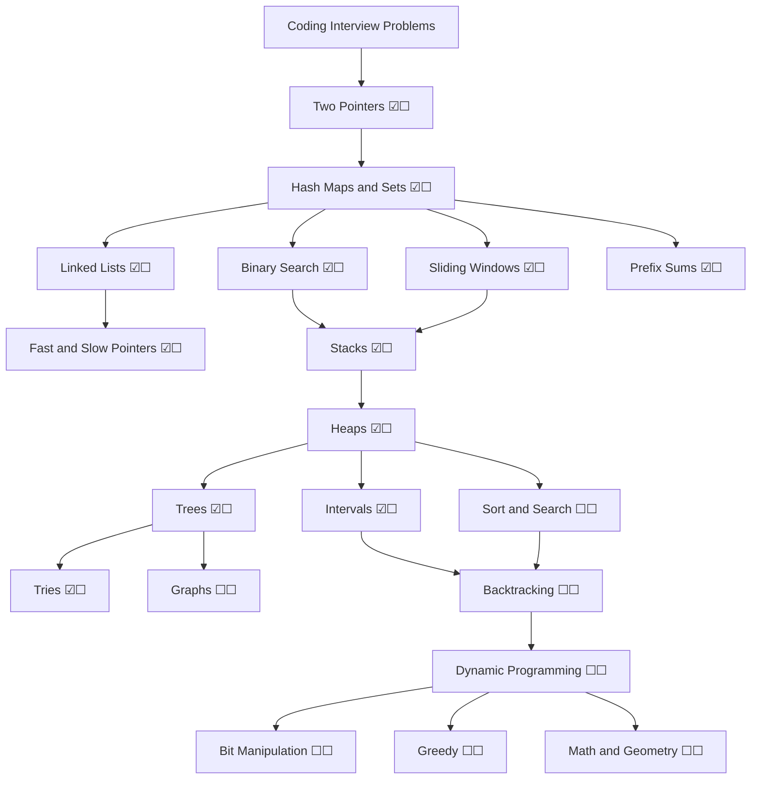

### flowchart TD

```mermaid
flowchart TD
A[Coding Interview Problems]
A --> B[ Two Pointers ☑☐]
B --> C[ Hash Maps and Sets ☑☐]

C --> D1[ Linked Lists ☑☐]
C --> D2[ Binary Search ☑☐]
C --> D3[ Sliding Windows ☑☐]
C --> D4[ Prefix Sums ☑☐]

D1 --> E1[ Fast and Slow Pointers ☑☐]

D2 --> E2[ Stacks ☑☐]
D3 --> E2

E2 --> F[ Heaps ☑☐]

F --> G1[ Trees ☑☐]
F --> G2[ Intervals ☑☐]
F --> G3[ Sort and Search ☐☐]

G1 --> H1[ Tries ☑☐]
G1 --> H2[ Graphs ☐☐]

G2 --> H3[ Backtracking ☐☐]
G3 --> H3

H3 --> I[ Dynamic Programming ☐☐]

I --> J1[ Bit Manipulation ☐☐]
I --> J2[ Greedy ☐☐]
I --> J3[ Math and Geometry ☐☐]
```